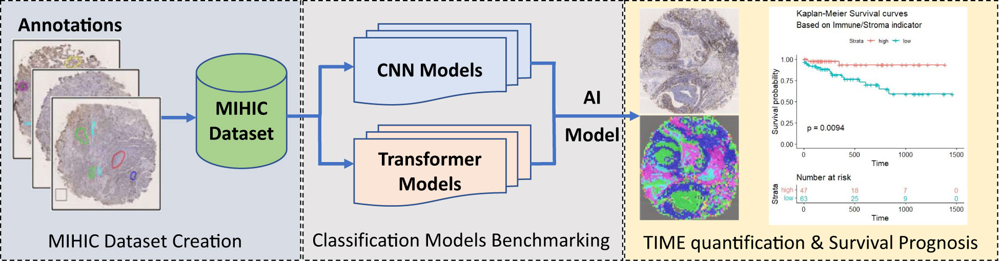

# IHC 조직 영역 분할 알고리즘

담당자: 영섭 이
진행 상태: 완료
프로젝트: IHC 바이오마커 AI (https://www.notion.so/IHC-AI-26142971c02f80b98f34fb6ee0ae865b?pvs=21), Medicus AI (https://www.notion.so/Medicus-AI-26142971c02f81eca1a2c6252f8b5565?pvs=21)
git repositories: https://github.com/Leeyoungsup/IHC_Tissue_Region_classification

# 용어정리

- **TPS** = “양성 **종양세포의 비율**(%)”.
- **CPS** = “양성 **종양+면역세포 수 / 종양세포 수 ×100**(0–100)”.
- **TAP** = PD-L1 양성 **종양세포 + 종양연관 면역세포**가 덮은 **전체 종양 면적 대비 비율(%)**. 즉, **세포를 세지 않고** “양성으로 염색된 영역의 커버리지”를 보고합니다. 시각적 추정/디지털 측정 모두 가능

# Dataset

**MIHIC (multiplex IHC histopathological image classification) Dataset**

- 12종 IHC 마커(CD3, CD8, Ki67 등) TMA 코어에서 7개 조직 클래스(Tumor, Stroma, Immune cells 등) 로 병리사가 직접 폴리곤으로 주석
- **환자/슬라이드**: 환자 114명, **TMA 섹션 47개** 수집(품질 문제 슬라이드 제외). **40× 배율**, 섹션 크기 약 **188,416×110,080 px**(약 42.7mm×24.9mm). 각 섹션은 코어 28–48개. [Zenodo](https://zenodo.org/records/10065510)
- **IHC 마커(12종)**: CD3, CD20, CD34, CD38, CD68, CDK4, Cyclin-D1, D2-40, FAP, Ki67, P53, SMA. [Zenodo](https://zenodo.org/records/10065510)
- **클래스(7종)**: Alveoli, Immune cells, **Necrosis**, Stroma, Tumor, Other, Background. (원문은 6개 조직 + Background 추가)
- **Total :** patch 309,608EA (Train : Validation : Test = 64 : 16 : 20)
- 20x (128,128) 크기의 이미지
- 관련 링크 : [https://www.frontiersin.org/journals/immunology/articles/10.3389/fimmu.2024.1334348/full](https://www.frontiersin.org/journals/immunology/articles/10.3389/fimmu.2024.1334348/full)

# Model

## EfficientNetV2 (Tan & Le, 2021)

- **목표**: 더 **빨리 학습**하면서도 **파라미터/연산 효율**을 높인 CNN.
- **핵심 아이디어**
    - **Fused-MBConv**: 초반 고해상도 stage에서 1×1 확장(conv)과 3×3 depthwise를 **하나의 3×3 conv**로 합쳐 GPU에서 학습 속도를 크게 개선.
    - **MBConv + SE**: 중·후반 stage는 기존 MBConv(Depthwise Separable + Squeeze-Excitation)로 표현력 유지.
    - **Training-aware scaling**: 모델/해상도/regularization을 **훈련 속도까지 고려**해 함께 스케일링.
    - **Progressive learning**: 학습 초반엔 **작은 이미지/약한 규제**, 후반으로 갈수록 **큰 이미지/강한 증강**으로 점진적 난이도 상승 → **학습 시간 단축**.
- **장점**
    - 동일 정확도 기준 **학습시간↓**, 메모리 사용량 안정적.
    - 작은 모델(S/M)도 강력한 전이학습 성능.
- **실전 팁**
    - 전이학습: `efficientnetv2_s`(timm)부터 시작 → 필요 시 `v2_m`, `v2_l`.
    - 증강은 **RandAugment/ColorJitter + Mixup/CutMix**와 궁합 좋음.
    - *channels_last + AMP(FP16)**로 학습/추론 속도 개선.
    
    
    
    
    

## SAM Optimizer (Sharpness-Aware Minimization, Foret et al., 2021)

- **문제의식**: 훈련 손실만 낮추면 종종 **Sharp(뾰족한) minima**에 빠져 **일반화가 나빠짐**.
- **핵심 아이디어**
    - min⁡wmax⁡∥ϵ∥≤ρL(w+ϵ)\displaystyle \min_w \max_{\|\epsilon\|\le \rho} \mathcal{L}(w+\epsilon)wmin∥ϵ∥≤ρmaxL(w+ϵ)
        
        → **주변(반경 ρ)에서 손실이 크게 증가하지 않는(평평한) 파라미터**를 찾도록 유도.
        
- **작동 방식(한 스텝에 두 번의 fwd/bwd)**
    1. 평소처럼 grad ggg 계산 → ϵ=ρ⋅g/∥g∥\epsilon = \rho\cdot g/\|g\|ϵ=ρ⋅g/∥g∥ (adaptive SAM은 www 스케일 반영)
    2. 가중치를 w+ϵw+\epsilonw+ϵ로 **임시 이동**해 다시 grad 계산 → **기저 옵티마이저(AdamW/SGD)**로 업데이트
        
        ⇒ **일반화/견고성↑**, 다만 **훈련 시간 ~1.5–2×**.
        
- **장점**
    - 데이터/증강 분포 변화, 라벨 노이즈, 과적합 환경에서 **성능·칼리브레이션 개선**.
    - **강증강(Mixup/CutMix)**, **코사인 스케줄**, **AdamW/SGD-momentum**과 잘 맞음.
- **주의/팁**
    - **BatchNorm 러닝스탯**은 1차(perturb) 계산에서 **업데이트 끄기** 권장.
    - ρ\rhoρ 범위: **0.05–0.2**(작은/중간 모델은 0.05~0.1부터), base LR은 보통 **그대로 또는 약간↓**.
    - 배치가 작을수록 ρ\rhoρ를 다소 줄이는 게 안정적.
    - 훈련 시간 증가(2배 안팎)와 메모리 여유 고려(질문자 GPU 10GB → `v2_s` + SAM 실전 가능).
    
    
    

# Performance

전체 정확도: 0.8238
Macro 평균 F1: 0.8011
Weighted 평균 F1: 0.8202

|  | Precision | Recall |  F1 |
| --- | --- | --- | --- |
| Background  | **0.9947** | **0.9985** | **0.9966** |
| Tumor | 0.8930 | 0.9518 |  0.9215 |
| Stroma | 0.6045 | 0.5545 | 0.5784 |
| Immune cells | 0.7375 | 0.7973 | 0.7663 |
| Necrosis | 0.9035 | 0.8582 | 0.8803 |
| Alveoli | 0.7976 | 0.7935 | 0.7956 |
| Other  | 0.6995 | 0.6440 | 0.6706 |

# WSI level analysis

